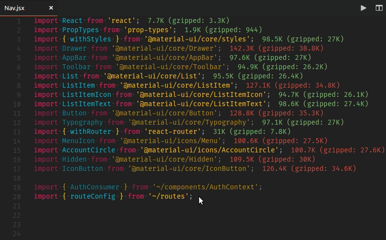

# import-organizer

Reorder and organize ES6+ import statements alphabetically, with local imports placed at the end of the import block.

## Features

Highlight the block of import statements you would like to sort, an select **Sort Imports** from the Command Palette.

## Known Issues

Doesn't handle multiline import statements

## Release Notes

### 0.1.1

Initial version release
