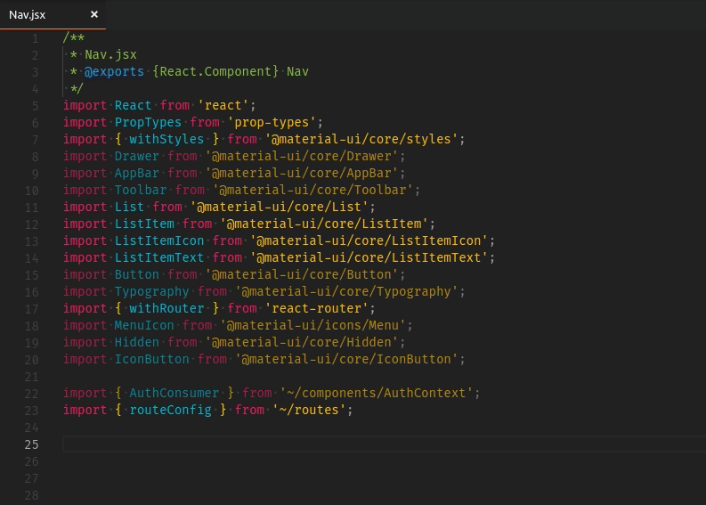
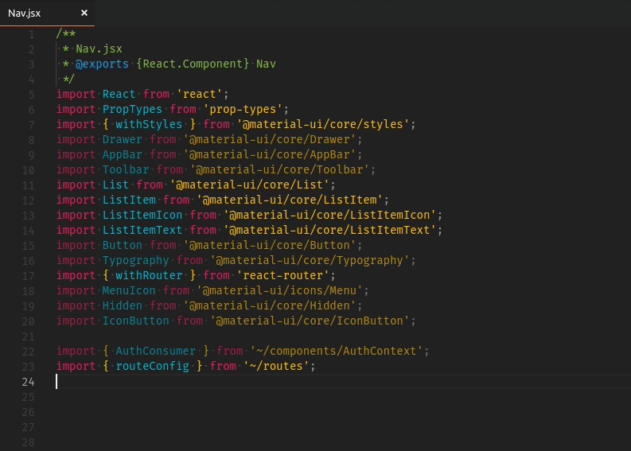

# import-organizer

Reorder and organize ES6+ import statements alphabetically, with local imports placed at the end of the import block. Duplicate imports will be removed.

## Features

Highlight the block of import statements you would like to sort, an select **Sort Imports** from the Command Palette.

If you run **Sort Imports** with no selection, the document will be parsed for import statements, \
and the entire block of imports (from first valid import to last valid import) will be replaced with the sorted imports. \
This will remove any comments or non-import statments found in the import statements.

### Sort all imports in file



### Sort a selected block of imports



## Notes

In the current version, import statements must match one of the following:

```js
/import ({?\s?[{\sA-Za-z\-\_\,]+\s?}?) from (["'][@A-Za-z0-9\-\/\~\.]+["'])(;?)/
/import (["'][@A-Za-z0-9\-\/\~\.]+["'])()(;?)/
```

## Known Issues

* Doesn't handle multiline import statements.
* Any comments in the block of imports will be deleted.

## Release Notes

### 0.1.1

Initial version release

### 0.2.0

Added functionality to sort entire import block without needing to select anything.